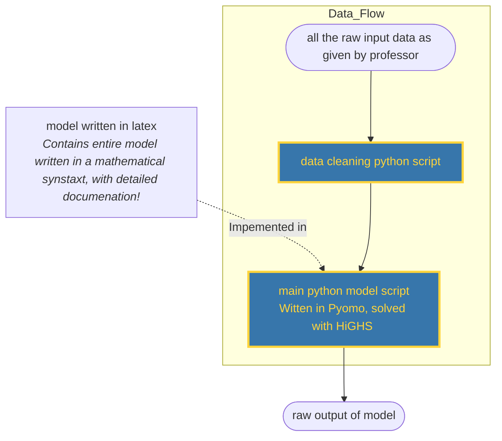

Is 


## meta-arcitcture


## specifics for this case
### - Use the data provided in the BEL20.zip file on Moodle to compute the average returns andthe variance-covariance matrix of the returns of the 21 assets.


This is done in data_cleaning.py 


- Use this as the input data to set up an optimization model to compute the optimal portfolio
under the Markowitz model of risk.

Pseudocode

```
for each exp_return in range(0,0.20,0.01): ##for each expected return between 0 and 20%, increments of 1%.
	minimise porfolio variance (using optimization model function)
	add minimised variance and portoflio info to pandas table
```

### - Use that optimization model to compute:
1) **the efficient frontier assuming no short selling, and**
Have a binary variable for short selling allowed or not allowed (simple adding or removing)


2) **the efficient/tangent portfolio when short selling is allowed.**

short selling allowed: binary var

The tangent thing: Depends on risk free, return, this should be an afterthought

- As a bonus, try to construct a good portfolio that contains only 3 assets (no short selling)

easy peasy, just create a new function

