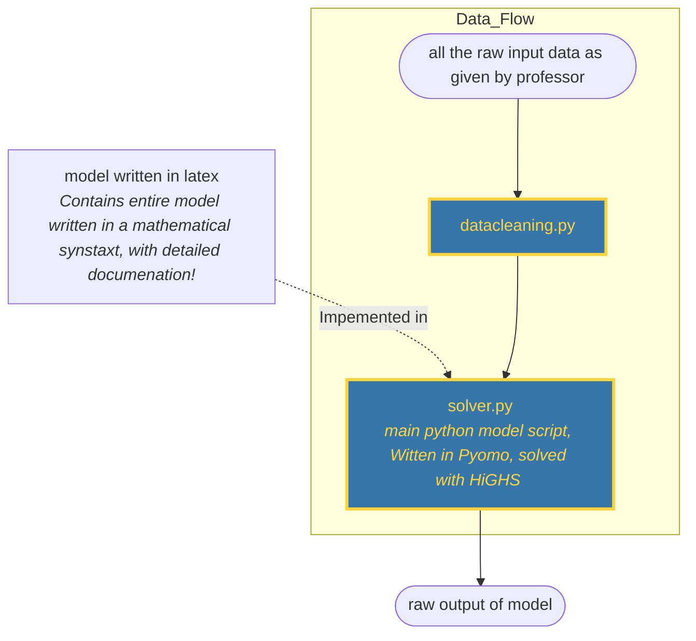

*AI Transparency: We used Claude Code, because LLM based tools can be a powerful companion in code based knowledge work. We where carefull to not use it as a substitute for our own thinking. 

## Methology

### General architecture

For our IT architecture we had a number of desirable characteristics.
1.  Programmatic approach (facilitates automation)
2. A tool we where familiar with
3. Open Source based 
4. Low complexity

Any IT Architecture is a compromise between different goals. The programmatic approach ruled out excel. When choosing between AMPL and Python, we decided to use Python because it is both open source and would be more beneficial for us in a work context. It is often easier to get access to a Python runtime than an AMPL runtime. The drawback of our approach is that using python packages increases the complexity (environment management is needed), by ruling out commercial solvers we might also be sacrificing some "computational performance", but the effect of this will be negligible for the scope our project.

We used the python package [Pyomo](https://www.pyomo.org/) as the modelling language. The benefit of this package is molecularity: Throughout the entire project we can use one modelling language interface, while swapping out the solver used on a problem to problem basis. For this preliminary report the solved [HIGHS ](https://highs.dev/)was used 
#### Design flowchart

Our architecture only has two Python scripts, this was done to lower the complexity. When the input data changes, the user simply needs to run two python scripts (in order) and then the entire analysis is done.

For graphs we used some python scripts after the raw output of the model step.

### Documentation for .py files

#### datacleaning.py

Just writ it down in Latex here, what be popping etc
#### solver.py

Write the model, you know this, skim the finance book.

## Findings

