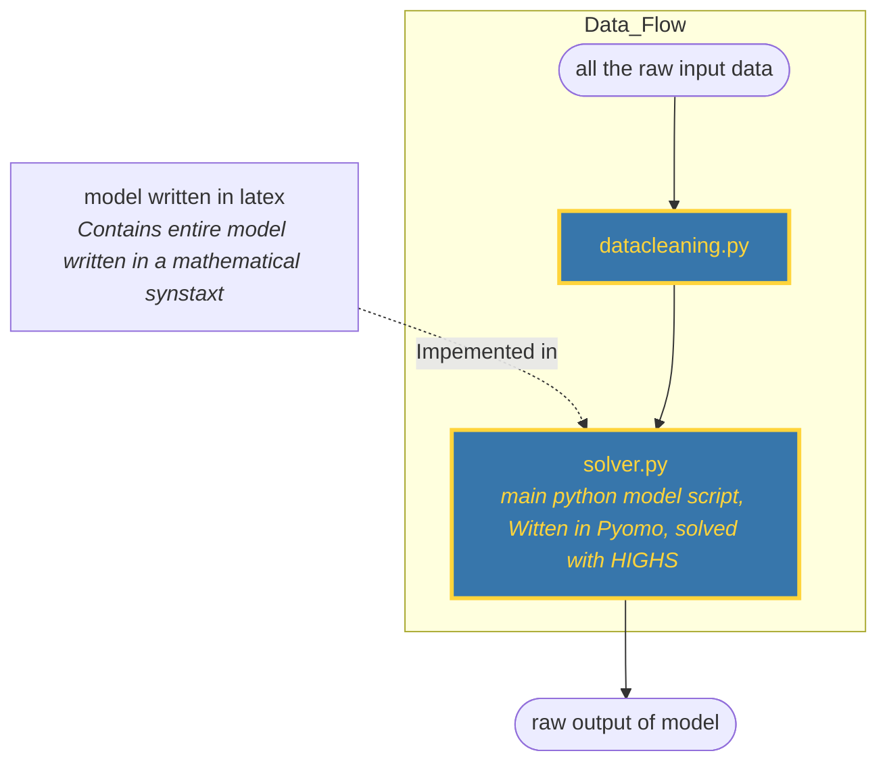

*AI Transparency: We used Claude Code, because LLM based tools can be a powerful companion in code based knowledge work. We where carefull to not use it as a substitute for our own thinking. 

## Methology

### General architecture

For our IT architecture we had a number of desirable characteristics.
1.  Programmatic approach (facilitates automation)
2. A tool we where familiar with
3. Open Source based 
4. Low complexity

Any IT Architecture is a compromise between different goals. The programmatic approach ruled out excel. When choosing between AMPL and Python, we decided to use Python because it is both open source and would be more beneficial for us in a work context. It is often easier to get access to a Python runtime than an AMPL runtime. The drawback of our approach is that using python packages increases the complexity (environment management is needed), by ruling out commercial solvers we might also be sacrificing some "computational performance", but the effect of this will be negligible for the scope our project.

We used the python package [Pyomo](https://www.pyomo.org/) as the modelling language. The benefit of this package is modularity: Throughout the entire project we can use one modelling language interface, while swapping out the solver used on a problem to problem basis. For this preliminary report the solved [HIGHS ](https://highs.dev/)was used 
#### Design flowchart

Our architecture only has two Python scripts, this was done to lower the complexity. When the input data changes, the user simply needs to run two python scripts (in order) and then the entire analysis is done.

For graphs we used some python scripts after the raw output of the model step.

### Documentation for .py files

#### datacleaning.py

We first convert the raw csv data into a a tidy data format (one col per ticker, one row per date). At this stage we see that we are missing 125 entries for the the ticker SYENS. Since the raw data is a csv, it is not readily apparent if this data is missing from the first dates or the last ones. For the rest of the analysis we assume that the the data is missing from the last 125 weeks. We could have replaced the missing data with from Yahoo finance, but we choose to not do so for the sake of simplicity.

#### computing average geometric returns

For each ticker, we compute the average geometric growth rate across all the 260 weeks with the following formula:

$$
g = \left(\frac{P_n}{P_0}\right)^{1/n}
$$

We interestingly note that that a lot of the stocks have had a net decrease in price during the 5 year time window, and thus give us a geometric growth multiplicator of bellow 1. One could argue that these stocks should not have a negative expected return, but this is a weakness of our frequnetist methology.

For SYENS we compute for the time window we have data available, which is only for the first 145 weeks.
#### computing covariance matrix

We first transform our tidy dataset from raw values to pct change, because this is a more interesting metric. We then calculate the covariance matrix using a pandas function, saving us from writing the logic by hand. This calculation excludes the NA values of SYENS.

At the end of the file we  save our cleaned data to a JSON file.

#### solver.py

##### No short selling allowed model formulation
In the main_optimization_model we implement both the short selling and non short selling optimization model. The non short selling model can be formulated as:

$$
\begin{align}
\min_{w} \quad & \sum_{i=1}^{n} \sum_{j=1}^{n} w_i w_j \text{Cov}(r_i, r_j) \\
\text{s.t.} \quad & \sum_{i=1}^{n} w_i = 1 \\
& \mu^T w \geq \bar{\mu} - \epsilon \\
& \mu^T w \leq \bar{\mu} + \epsilon \\
& w_i \geq 0 \quad \forall i = 1, \ldots, n
\end{align}
$$

where:
- $w_i$ = weight allocated to asset $i$ (between 0 and 1 for no-short case)
- $\Sigma_{ij}$ = covariance between asset $i$ and asset $j$ 
- $\mu_i$ = expected weekly growth rate for asset $i$ 
- $\bar{\mu}$ = target portfolio return we want to achieve
- $\epsilon = 0.0001$ = tolerance (we allow the portfolio return to be within ±0.0001 of the target)
- $n$ = 20 (number of stocks in the BEL20 index)

The model minimizes portfolio variance (risk) subject to achieving approximately the target return, with all weights constrained to be non-negative (no short selling allowed). The tolerance band allows the solver flexibility to find feasible solutions when the exact target return is unachievable. The unit of measure for the return rate is weekly geometric growth factor (ie 1.001 for a weekly increase of 0.1%)

##### Short selling allowed model formulation

In the short selling allowed version the only change we make is that negative values are allowed, ie. 

$$
w_i \in \mathbb{R} \quad \forall i = 1, \ldots, n
$$

#### Methology for running the models

For the no short selling model the logical upper and lower boundary for Expected return are given by the min and max value of `exp_return_list` (this is the list of expected `mu` calculated in the datacleaning.py file). For the short selling allowed model we set the lower value equal to the min of `exp_return_list`, and a maximum set to the max of `exp_return_list` + 0.01. These chosen values are of course somewhat arbitrary, but where set explicitly to allow for running the analysis automatically. When the max and min value are set the the list is populated with increments of 0.001

Once we had the exp_return_list for both short and no short we run a for loop to iterative over all the desired exp returns, running the solver and minimizing the variance for each entry

The output is saved to JSON files.

## Findings

![[efficient_frontier.png]]

Above are the results of the solver. The efficient frontier for no short selling is quite small, with only 2-3 data points, this is because there stock with the highest expected return "only" has a return of 1.034. While for the short selling allowed the frontier is similar (although slightly better) for expected returns of 1-1.034, but the possibility of shorting stocks allows for shorting low/negative expected returns stocks in order to buying expected return stocks. This comes at the cost of higher variance.

For both the short and no short cases, we see that the points on the graph bellow an expected return of 1.001 (approximate) are not efficient.

## Bonus: 3 Stock portfolio

Will get back to tmr, gotta change solver. 

## Appendix

The core files for running the analysis can be found in the following locations:

or-central-repo/
├── prelim-assign/
│   ├── bel20_2026.csv
│   └── codebase/src/codebase/
│       ├── datacleaning.py
│       ├── solver.py
│       ├── data_cleaned.json
│       └── solver.output.json